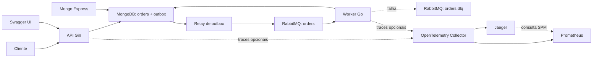

# Arquitetura

## Visão geral

O sistema separa a aceitação síncrona do pedido de seu processamento. A API
persiste o pedido e o evento de outbox na mesma transação MongoDB. Um relay do
worker publica o evento confirmado pelo RabbitMQ, e o consumer atualiza o
status do pedido até sua conclusão.



## Infraestrutura e ciclo de vida

O Compose base inicia API, worker, RabbitMQ, MongoDB e `mongo-init`.
`mongo-init` configura o replica set de nó único `rs0` e cria os índices antes
de API e worker iniciarem. Os volumes `mongo-data` e `mongo-config` preservam
dados e a chave interna do MongoDB entre recriações. O volume `rabbitmq-data`
preserva as filas duráveis e suas mensagens entre recriações do broker.

API e worker aguardam a inicialização do replica set; o worker também aguarda
o healthcheck do RabbitMQ. O healthcheck da API chama `GET /health`, que só
retorna `204` quando MongoDB responde ao ping; caso contrário retorna `503`.
A API trata `SIGTERM` e `SIGINT`, deixa de aceitar conexões e aguarda até
`HTTP_SHUTDOWN_TIMEOUT` (`10s`) pelas requisições em andamento. O Compose
reserva 15 segundos antes de forçar seu encerramento.

As interfaces de desenvolvimento são opt-in: Mongo Express, Jaeger e as portas
locais de MongoDB e RabbitMQ são adicionados apenas por
`docker-compose.interfaces.yml`. Esse arquivo adiciona Collector e Prometheus,
habilitando o SPM do Jaeger. Todos os valores de execução ficam nos arquivos
Compose; não há `.env`.

## Organização do código

```text
cmd/                 pontos de entrada da API e do worker
config/              leitura das variáveis de ambiente
internal/bootstrap/  composição específica de pedidos e rotas Gin
internal/core/       domínio, portas e casos de uso
internal/enum/       estados compartilhados de pedidos e eventos de outbox
internal/inbound/    handlers HTTP, consumer e relay do worker
internal/outbound/   adapters, DTOs/models e mappers de Mongo/RabbitMQ/outbox
pkg/mongo/           operação genérica do driver MongoDB
pkg/rabbitmq/        operação genérica AMQP, consumer e DLQ
infra/mongo/         inicialização do replica set e índices MongoDB
infra/rabbitmq/      definitions e configuração do broker
infra/observability/ configurações do Collector, Prometheus e UI do Jaeger
docs/                documentação Swagger gerada
```

O `core` depende apenas das portas. Adapters traduzem DTOs ou models nas
bordas, e mappers fazem conversões determinísticas. Os pontos de entrada
conectam somente implementações de `pkg`; `buildOrder` compõe o fluxo específico
de pedidos, seus mappers, adapters e casos de uso.

## Pedido e persistência

Um pedido nasce com status `CRIADO`. O worker salva `PROCESSANDO`, aguarda dois
segundos e, após concluir, salva `PROCESSADO`. Cada transição atualiza
`updated_at` no domínio e o mapper a persiste como `updatedAt`.

A criação usa `InsertOne` e o índice único de `order_id`. As transições usam
`ReplaceOne` sem `upsert`; uma mensagem reprocessada não pode criar outro
documento. Cada operação MongoDB — conexão, ping, leitura, escrita, transação
e outbox — tem o timeout `MONGODB_OPERATION_TIMEOUT` de cinco segundos. Um
contexto já mais restritivo continua sendo respeitado.

Os índices estão em [infra/mongo/init.js](infra/mongo/init.js): índice único parcial de
`order_id` para compatibilidade com documentos legados, índice único de
`event_id` e índices compostos para busca e recuperação de leases da outbox.

## Transactional outbox

A criação de um pedido grava, em uma única transação MongoDB, o documento em
`orders` e um evento `PENDING` em `outbox`. Assim, a API não confirma um pedido
sem um evento durável para seu processamento e não depende da disponibilidade
imediata do RabbitMQ para responder `201`.

O relay busca o evento pendente mais antigo, marca-o como `PROCESSING` com um
lease de `OUTBOX_LEASE_DURATION` (`15s`) e um `lease_token` exclusivo, e tenta
publicá-lo. Após o publisher confirm do RabbitMQ, registra `PUBLISHED`. Cada
transição exige o mesmo token: um relay atrasado não altera um evento que outro
worker já reassumiu. Em uma falha, o evento retorna a `PENDING`; se o worker
cair, o lease expira e outro relay pode retomá-lo. O intervalo entre tentativas
é `OUTBOX_RETRY_INTERVAL` (`1s`).

Após `OUTBOX_MAX_ATTEMPTS` falhas (cinco no Compose), o relay publica o payload
original em `orders.dlq` com `x-failure-reason` e marca o evento como
`DEAD_LETTERED`. Se a publicação na DLQ falhar, ele volta a `PENDING` para nova
tentativa quando o RabbitMQ estiver disponível.

O fluxo é *at-least-once*: uma queda após o `Ack` do RabbitMQ e antes de marcar
o evento como `PUBLISHED` pode causar nova publicação. O processamento do
pedido permanece seguro por atualizar o mesmo `order_id`, sem criar documento.

## Mensageria e DLQ

As filas são declaradas antes da aplicação iniciar em
[infra/rabbitmq/definitions.json](infra/rabbitmq/definitions.json): `orders` é a fila
durável de trabalho e `orders.dlq`, a fila durável de análise. Ambas usam o
vhost `/` e o usuário `app` definido nas definitions.

O relay publica mensagens persistentes e espera *publisher confirms*. Um
`Nack`, conexão encerrada ou espera superior a `RABBITMQ_PUBLISH_TIMEOUT`
(`5s`) deixa o evento disponível para nova tentativa. O consumer usa
confirmação manual e `prefetch=1`: após persistir as duas transições do pedido,
envia `Ack` e remove a mensagem de `orders`.

Mensagens inválidas ou que falham no caso de uso não recebem `Reject` ou
`Nack`. O consumer republica o payload original de forma persistente e
obrigatória em `orders.dlq`, preserva os demais metadados AMQP e acrescenta
`x-failure-reason`. Ele só confirma a origem após o publisher confirm e a
verificação de roteamento da DLQ. É uma *parking queue* explícita, não consumida
automaticamente. Se a republicação falhar, não há `Ack`; com o fechamento da
conexão, a mensagem retorna para `orders`.

`orders` também possui dead-letter exchange como proteção de infraestrutura,
mas o caminho normal é a republicação explícita.

### Testar a DLQ manualmente

Com as interfaces ativas, publique JSON inválido em `orders`:

```bash
curl -u app:app \
  -H 'Content-Type: application/json' \
  -X POST 'http://localhost:15672/api/exchanges/%2F/amq.default/publish' \
  --data '{
    "properties": {"delivery_mode": 2, "content_type": "application/json"},
    "routing_key": "orders",
    "payload": "payload-invalido",
    "payload_encoding": "string"
  }'
```

O RabbitMQ responde `{"routed":true}`. O worker registra
`message sent to dead-letter queue`. Confira a mensagem sem consumi-la:

```bash
curl -s -u app:app 'http://localhost:15672/api/queues/%2F/orders.dlq'
```

O campo `messages` deve ser `1`; no painel, a mensagem contém o payload
original e o header `x-failure-reason`.

## Escalabilidade e telemetria

Há uma réplica de worker por padrão. Cada réplica possui consumer com
`prefetch=1` e relay próprio. O claim atômico e o lease da outbox impedem que
relays disputem o mesmo evento. Com o atraso obrigatório de dois segundos,
quatro réplicas processam aproximadamente dois pedidos por segundo.

A telemetria implementa tracing com OpenTelemetry. Com as interfaces ativas,
API e worker enviam traces OTLP gRPC ao Collector, identificado como
`otel-collector:4317`, que os encaminha ao Jaeger. Os serviços são
`orders-api` e `orders-worker`. Para um coletor externo, altere `OTEL_ENABLED`,
`OTEL_SERVICE_NAME` e `OTEL_EXPORTER_OTLP_ENDPOINT` nos dois serviços.

Os traces incluem requisições Gin, MongoDB, relay de outbox e operações
RabbitMQ de publicação, consumo e envio à DLQ. O contexto W3C (`traceparent`)
é persistido no evento de outbox e transferido aos headers AMQP, permitindo
visualizar a criação pela API, a publicação e o processamento no mesmo trace.

O Collector também transforma os spans em métricas RED (taxa de requisições,
erros e duração) com o conector `spanmetrics`. O Prometheus armazena essas
métricas, e a aba **Monitor** do Jaeger exibe agregações de serviço e operação,
incluindo P50, P75 e P95. Isso usa somente os spans existentes; a aplicação não
exporta métricas próprias. O conector exporta as agregações em lote; após gerar
traces, a primeira visualização pode levar até um minuto para ficar disponível.
