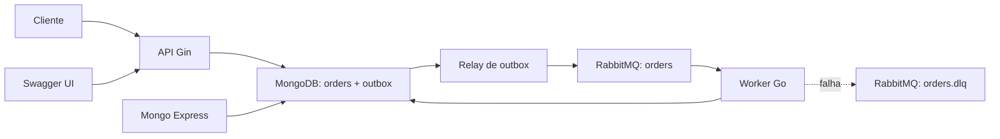

# MJV challenge

Sistema assíncrono de pedidos em Go. A API persiste o pedido e seu evento de
outbox na mesma transação MongoDB; o worker publica esse evento e processa o
pedido recebido pelo RabbitMQ.



## Serviços e infraestrutura

O [compose.yaml](compose.yaml) inicia seis serviços de aplicação e apoio.
Todos possuem valores fixados no Compose; não há necessidade de `.env`.

| Serviço | Porta | Responsabilidade |
| --- | --- | --- |
| `api` | `8080` | Expõe HTTP, Swagger e cria pedidos com eventos de outbox. |
| `worker` | — | Publica a outbox, consome `orders` e atualiza o processamento. |
| `rabbitmq` | `5672`, `15672` | Mensageria e painel de administração. |
| `mongo` | `27017` | Armazena os documentos de `orders` e `outbox`. |
| `mongo-init` | — | Inicializa o replica set `rs0` exigido por transações. |
| `mongo-express` | `8081` | Visualização dos documentos do MongoDB. |

API e worker aguardam a inicialização do replica set; o worker também aguarda
o healthcheck do RabbitMQ. Os dados e a chave interna do MongoDB ficam nos
volumes nomeados `mongo-data` e `mongo-config`, preservados entre recriações.

Credenciais locais de desenvolvimento:

| Componente | Usuário | Senha |
| --- | --- | --- |
| RabbitMQ | `app` | `app` |
| MongoDB | `root` | `root` |
| Mongo Express | `admin` | `admin` |

## Executar e operar

```bash
make rebuild
```

| Comando | Efeito |
| --- | --- |
| `make build` | Constrói as imagens da API e do worker. |
| `make up` | Inicia imagens já construídas em segundo plano. |
| `make rebuild` | Reconstrói e inicia todos os serviços. |
| `make down` | Para os containers; o volume do MongoDB é preservado. |
| `make logs` | Acompanha os logs de todos os serviços. |
| `make ps` | Exibe o estado dos containers. |
| `make swagger` | Regenera os arquivos em `docs/`. |
| `make deps` | Baixa dependências Go para a primeira execução local. |

As dependências Go não são versionadas. Execute `make deps` antes da primeira
execução local; a imagem Docker usa o cache de módulos do BuildKit para evitar
novos downloads enquanto `go.mod` e `go.sum` não mudarem. O Dockerfile cria um
binário estático em Alpine e executa-o com um usuário sem privilégios.

Endereços locais:

- API: `http://localhost:8080`
- Swagger UI: `http://localhost:8080/swagger/index.html`
- RabbitMQ Management: `http://localhost:15672`
- Mongo Express: `http://localhost:8081`

Para publicar a API em outro ambiente, altere `SWAGGER_HOST` no serviço `api`
do Compose para o host público, sem protocolo.

## API HTTP

| Método e rota | Resposta | Descrição |
| --- | --- | --- |
| `POST /orders` | `201` | Cria o pedido e registra seu evento assíncrono. |
| `GET /orders/:id` | `200` / `404` | Busca um pedido persistido pelo identificador. |
| `GET /health` | `204` | Healthcheck leve da API. |
| `GET /swagger/index.html` | `200` | Interface Swagger. |

Exemplo de criação:

```bash
curl -i -X POST http://localhost:8080/orders \
  -H 'Content-Type: application/json' \
  -d '{"product_name":"Caderno","quantity":2}'
```

`product_name` é obrigatório e `quantity` deve ser maior que zero; violações
retornam `400` antes de qualquer persistência ou publicação. O corpo contém
`err` e, para validações de campo, a lista `errors`, por exemplo:

```json
{"err":"invalid request data","errors":[{"field":"quantity","message":"must be greater than zero"}]}
```

O documento retorna `id`, `status`, `created_at` e `updated_at`. A criação usa
o status `CRIADO`; o worker registra `PROCESSANDO` e, após concluir, salva
`PROCESSADO`, atualizando `updated_at` em cada transição. Os saves no MongoDB
usam `ReplaceOne` com `upsert` por `order_id`, para não criar outro documento ao
processar novamente uma mensagem.
Na criação, a tentativa de escrita no MongoDB usa timeout de cinco segundos,
evitando que a API fique aguardando uma conexão indisponível indefinidamente.
O valor é configurado no Compose por `MONGODB_SAVE_TIMEOUT` (`5s`).

Na persistência, o mapper converte o domínio para os campos requeridos pelo
desafio: `order_id`, `product`, `quantity`, `status` e `created_at`, além de
`updatedAt` para registrar a última alteração. Essa representação é isolada em
`internal/outbound/repository/model` e não altera o contrato HTTP.
O índice único é parcial para permitir que volumes locais com documentos legados
inicializem; migre ou recrie esses documentos caso precise consultá-los pelo
novo `order_id`.

## Transactional outbox

A criação de um pedido executa uma única transação MongoDB: grava o documento
em `orders` e um evento `PENDING` em `outbox`. Portanto, o pedido não pode ser
confirmado sem que exista um evento durável que represente seu processamento.
Por esse motivo, a API não se conecta ao RabbitMQ e pode responder `201` mesmo
quando o broker estiver temporariamente indisponível.

O relay do worker busca o evento pendente mais antigo, marca-o como
`PROCESSING` com um lease de `OUTBOX_LEASE_DURATION` (`15s`) e tenta publicá-lo.
Após a confirmação do RabbitMQ, marca o evento como `PUBLISHED`. Em falha, o
evento volta imediatamente a `PENDING`; se o worker cair, o lease expira e
outro relay poderá retomá-lo. O período entre tentativas é
`OUTBOX_RETRY_INTERVAL` (`1s`).

Se a conexão exclusiva do publisher for encerrada, o relay recria a conexão e
o canal antes da próxima tentativa. Se a conexão do consumer for encerrada, o
worker encerra com erro e o Compose o reinicia (`restart: unless-stopped`),
reabrindo consumer e relay. Fechamentos remotos já não geram erro durante a
liberação dos recursos locais.

O fluxo tem semântica *at-least-once*: se o processo cair após o `Ack` do
RabbitMQ e antes de registrar `PUBLISHED`, o evento poderá ser publicado de
novo. O processamento do pedido permanece seguro porque a atualização usa o
mesmo `order_id` e não cria novo documento.

MongoDB executa em um replica set de nó único (`rs0`), pois transações exigem
esse modo. Para usar a aplicação fora do Compose, a URI deve conter
`replicaSet=rs0` e apontar para um MongoDB configurado como replica set.

## Mensageria e DLQ

As filas são declaradas antes da aplicação iniciar em
[rabbitmq/definitions.json](rabbitmq/definitions.json):

- `orders`: fila durável de trabalho;
- `orders.dlq`: fila durável de mensagens que exigem análise;
- ambas usam o vhost `/` e o usuário `app` definido nas definitions.

As mensagens publicadas pelo relay são persistentes. O relay usa *publisher
confirms*: só marca o evento como `PUBLISHED` após o `Ack` do broker; um `Nack`,
conexão encerrada ou espera superior a `RABBITMQ_PUBLISH_TIMEOUT` (`5s` no
Compose) deixa o evento disponível para nova tentativa. O consumer usa
confirmação manual e `prefetch=1`: processa somente uma entrega pendente por
vez. Após persistir as duas transições do pedido, confirma a entrega com `Ack`,
removendo-a de `orders`.

Uma mensagem inválida ou com falha no caso de uso não recebe `Reject` ou
`Nack`. O consumer republica o payload original para `orders.dlq`, preserva os
metadados AMQP, adiciona `x-failure-reason` e só então confirma a mensagem de
origem. Portanto, a DLQ é uma *parking queue* explícita da aplicação: ela não
é consumida automaticamente e pode ser inspecionada ou reenviada pelo painel.
Se a republicação falhar, não há `Ack`; ao fechar a conexão, a mensagem retorna
para `orders`.

`orders` também possui configuração de dead-letter exchange como proteção de
infraestrutura, mas o fluxo normal usa a republicação explícita descrita acima.

### Testar a DLQ manualmente

Com os serviços ativos, publique JSON inválido em `orders`:

```bash
curl -u app:app \
  -H 'Content-Type: application/json' \
  -X POST 'http://localhost:15672/api/exchanges/%2F/amq.default/publish' \
  --data '{
    "properties": {"delivery_mode": 2, "content_type": "application/json"},
    "routing_key": "orders",
    "payload": "payload-invalido",
    "payload_encoding": "string"
  }'
```

O RabbitMQ responde `{"routed":true}`. O worker deve registrar
`message sent to dead-letter queue`:

```bash
docker compose logs -f worker
```

Confira a mensagem sem consumi-la:

```bash
curl -s -u app:app 'http://localhost:15672/api/queues/%2F/orders.dlq'
```

O campo `messages` deve ser `1`. No painel, a mensagem contém o payload
original e o header `x-failure-reason`.

## Organização do código

```text
cmd/                 pontos de entrada da API e do worker
config/              leitura das variáveis de ambiente
internal/bootstrap/  composição específica de pedidos e rotas Gin
internal/core/       domínio, portas e casos de uso
internal/inbound/    handlers HTTP, consumer e relay do worker
internal/outbound/   adapters, DTOs/models e mappers de Mongo/RabbitMQ/outbox
pkg/mongo/           operação genérica do driver MongoDB
pkg/rabbitmq/        operação genérica AMQP, consumer e DLQ
rabbitmq/            definitions e configuração do broker
docs/                documentação Swagger gerada
```

O `core` depende apenas das portas. Os adapters traduzem DTOs ou models nas
bordas e os mappers fazem conversões determinísticas. A `main` conecta somente
as implementações de `pkg`; `buildOrder` no bootstrap compõe o fluxo específico
de pedido, seus mappers, adapters e casos de uso.

## Testes

Execute a suíte unitária com:

```bash
go test ./...
```

Os testes cobrem casos de uso, mappers, handlers HTTP, adapter de repositório,
outbox, consumer de domínio e regras puras de serialização/DLQ. As integrações
reais com MongoDB e RabbitMQ são exercitadas ao subir o Compose e pelo
procedimento manual da DLQ acima.

## Próximas evoluções

1. Adicionar testes de integração com MongoDB e RabbitMQ isolados em
   containers de teste.
2. Finalizar o encerramento gracioso da API, aguardando requisições em curso.
3. Revisar nomes de arquivos, funções, métodos, interfaces, structs e pastas
   para manter o vocabulário do projeto coeso.
