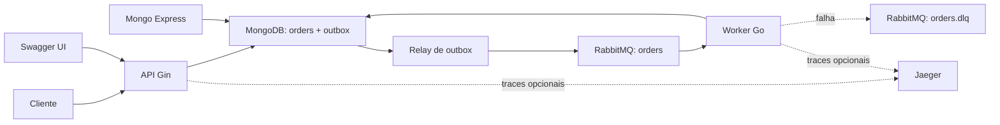

# MJV challenge

Sistema assíncrono de pedidos em Go. A API persiste o pedido e seu evento de
outbox na mesma transação MongoDB; o worker publica esse evento e processa o
pedido recebido pelo RabbitMQ.



## Serviços e infraestrutura

O [docker-compose.yml](docker-compose.yml) inicia somente o fluxo obrigatório.
As interfaces locais ficam no
[docker-compose.interfaces.yml](docker-compose.interfaces.yml), para que não
consumam recursos durante uma execução normal. Todos os valores estão fixados
no Compose; não há necessidade de `.env`.

| Serviço | Compose | Porta | Responsabilidade |
| --- | --- | --- | --- |
| `api` | base | `8080` | Expõe HTTP, Swagger e cria pedidos com eventos de outbox. |
| `worker` | base | — | Publica a outbox, consome `orders` e atualiza o processamento. |
| `rabbitmq` | base | — | Mensageria; portas locais no compose de interfaces. |
| `mongo` | base | — | Armazena `orders` e `outbox`; porta local no compose de interfaces. |
| `mongo-init` | base | — | Inicializa o replica set `rs0` e os índices de `orders` e `outbox`. |
| `mongo-express` | interfaces | `8081` | Visualização dos documentos do MongoDB. |
| `jaeger` | interfaces | `16686` | Recebe telemetria OTLP e permite explorar traces. |

API e worker aguardam a inicialização do replica set; o worker também aguarda
o healthcheck do RabbitMQ. Os dados e a chave interna do MongoDB ficam nos
volumes nomeados `mongo-data` e `mongo-config`, preservados entre recriações.
`make up-interfaces` ativa a exportação de traces e pode recriar API e worker
para aplicar essa configuração.

Por padrão há uma réplica de worker. Para processar mensagens em paralelo,
suba o stack já escalado ou altere-o em execução:

```bash
make up WORKER_REPLICAS=4
make scale-workers WORKER_REPLICAS=4
```

Cada réplica possui seu próprio consumer com `prefetch=1` e seu próprio relay
da outbox. Portanto, com o atraso obrigatório de dois segundos, quatro réplicas
processam aproximadamente dois pedidos por segundo. O claim atômico e o lease
da outbox coordenam os relays sem concorrência sobre o mesmo evento.

A API permanece com uma réplica, exposta em `localhost:8080`. O Compose atual
não a escala porque essa porta é publicada diretamente no host; portanto, os
testes de carga medem a capacidade de uma única API e de um MongoDB local.

Os comandos de carga aplicam `WORKER_REPLICAS` automaticamente antes de iniciar
o k6. Os perfis `sustainable` e `saturation` também ajustam sua taxa: o primeiro
envia uma requisição a cada três segundos por réplica; o segundo envia duas por
segundo por réplica. Por exemplo:

```bash
make load-sustainable WORKER_REPLICAS=4
make load-saturation WORKER_REPLICAS=4
```

Ao receber `SIGTERM` ou `SIGINT`, a API deixa de aceitar conexões e aguarda até
`HTTP_SHUTDOWN_TIMEOUT` (`10s`) por requisições em andamento. O Compose reserva
`15s` antes de forçar o encerramento do container.

Credenciais locais de desenvolvimento:

| Componente | Usuário | Senha |
| --- | --- | --- |
| RabbitMQ | `app` | `app` |
| MongoDB | `root` | `root` |
| Mongo Express | `admin` | `admin` |

## Executar e operar

```bash
make rebuild
```

| Comando | Efeito |
| --- | --- |
| `make build` | Constrói as imagens da API e do worker. |
| `make up` | Inicia apenas a aplicação e suas dependências obrigatórias. |
| `make rebuild` | Reconstrói e inicia o stack base. |
| `make up-interfaces` | Inicia o stack com Jaeger, Mongo Express e portas locais de Mongo/RabbitMQ. |
| `make scale-workers WORKER_REPLICAS=N` | Ajusta a quantidade de réplicas do worker em execução. |
| `make down` | Para os containers, inclusive interfaces; os volumes são preservados. |
| `make logs` | Acompanha os logs do stack e das interfaces quando ativas. |
| `make ps` | Exibe o estado dos containers e interfaces. |
| `make swagger` | Regenera os arquivos em `docs/`. |
| `make deps` | Baixa dependências Go para a primeira execução local. |
| `make load-smoke` | Escala workers e executa um pedido completo pelo k6. |
| `make load-sustainable` | Escala workers e executa carga estável. |
| `make load-saturation` | Escala workers e executa carga para observar acúmulo. |
| `make load-stress` | Escala workers e eleva a escrita até 1.000 pedidos/s. |

As dependências Go não são versionadas. Execute `make deps` antes da primeira
execução local; a imagem Docker usa o cache de módulos do BuildKit para evitar
novos downloads enquanto `go.mod` e `go.sum` não mudarem. O Dockerfile cria um
binário estático em Alpine e executa-o com um usuário sem privilégios.

Endereços locais com `make up-interfaces`:

- API: `http://localhost:8080`
- Swagger UI: `http://localhost:8080/swagger/index.html`
- RabbitMQ Management: `http://localhost:15672`
- Mongo Express: `http://localhost:8081`
- Jaeger UI: `http://localhost:16686`

Para publicar a API em outro ambiente, altere `SWAGGER_HOST` no serviço `api`
do Compose para o host público, sem protocolo.

## API HTTP

| Método e rota | Resposta | Descrição |
| --- | --- | --- |
| `POST /orders` | `201` | Cria o pedido e registra seu evento assíncrono. |
| `GET /orders/:id` | `200` / `404` | Busca um pedido persistido pelo identificador. |
| `GET /health` | `204` | Healthcheck leve da API. |
| `GET /swagger/index.html` | `200` | Interface Swagger. |

Exemplo de criação:

```bash
curl -i -X POST http://localhost:8080/orders \
  -H 'Content-Type: application/json' \
  -d '{"product_name":"Caderno","quantity":2}'
```

`product_name` é obrigatório e `quantity` deve ser maior que zero; violações
retornam `400` antes de qualquer persistência ou publicação. O corpo contém
`err` e, para validações de campo, a lista `errors`, por exemplo:

```json
{"err":"invalid request data","errors":[{"field":"quantity","message":"must be greater than zero"}]}
```

O documento retorna `id`, `status`, `created_at` e `updated_at`. A criação usa
o status `CRIADO`; o worker registra `PROCESSANDO`, aguarda dois segundos e,
após concluir, salva `PROCESSADO`, atualizando `updated_at` em cada transição.
A criação usa `InsertOne` e o índice único de `order_id`; as transições usam
`ReplaceOne` sem `upsert`, portanto uma mensagem reprocessada não cria outro
documento.
Na criação, toda a transação MongoDB tem timeout de cinco segundos — sessão,
gravação do pedido, inserção da outbox e commit — evitando que a API aguarde
uma conexão indisponível indefinidamente. O valor é configurado no Compose por
`MONGODB_SAVE_TIMEOUT` (`5s`).

Na persistência, o mapper converte o domínio para os campos requeridos pelo
desafio: `order_id`, `product`, `quantity`, `status` e `created_at`, além de
`updatedAt` para registrar a última alteração. Essa representação é isolada em
`internal/outbound/repository/model` e não altera o contrato HTTP.
Os índices pertencem ao schema Docker em [`mongo/init.js`](mongo/init.js),
executado pelo serviço `mongo-init` antes de API e worker. Há índice único
parcial de `order_id` para compatibilidade com documentos legados, índice único
de `event_id` e índices compostos para busca e recuperação de leases da outbox.

## Transactional outbox

A criação de um pedido executa uma única transação MongoDB: grava o documento
em `orders` e um evento `PENDING` em `outbox`. Portanto, o pedido não pode ser
confirmado sem que exista um evento durável que represente seu processamento.
Por esse motivo, a API não se conecta ao RabbitMQ e pode responder `201` mesmo
quando o broker estiver temporariamente indisponível.

O relay do worker busca o evento pendente mais antigo, marca-o como
`PROCESSING` com um lease de `OUTBOX_LEASE_DURATION` (`15s`) e tenta publicá-lo.
Após a confirmação do RabbitMQ, marca o evento como `PUBLISHED`. Em falha, o
evento volta imediatamente a `PENDING`; se o worker cair, o lease expira e
outro relay poderá retomá-lo. O período entre tentativas é
`OUTBOX_RETRY_INTERVAL` (`1s`).

Após cinco falhas de publicação (`OUTBOX_MAX_ATTEMPTS=5`), o relay publica o
payload original em `orders.dlq` com o header `x-failure-reason` e marca o
evento como `DEAD_LETTERED`. Esse estado não é selecionado novamente pelo relay.
Caso essa publicação na DLQ também falhe, o evento volta a `PENDING` para que a
tentativa de estacionamento seja repetida quando o RabbitMQ estiver disponível.

Se a conexão exclusiva do publisher for encerrada, o relay recria a conexão e
o canal antes da próxima tentativa. Se a conexão do consumer for encerrada, o
worker encerra com erro e o Compose o reinicia (`restart: unless-stopped`),
reabrindo consumer e relay. Fechamentos remotos já não geram erro durante a
liberação dos recursos locais.

O fluxo tem semântica *at-least-once*: se o processo cair após o `Ack` do
RabbitMQ e antes de registrar `PUBLISHED`, o evento poderá ser publicado de
novo. O processamento do pedido permanece seguro porque a atualização usa o
mesmo `order_id` e não cria novo documento.

MongoDB executa em um replica set de nó único (`rs0`), pois transações exigem
esse modo. Para usar a aplicação fora do Compose, a URI deve conter
`replicaSet=rs0` e apontar para um MongoDB configurado como replica set.

## Mensageria e DLQ

As filas são declaradas antes da aplicação iniciar em
[rabbitmq/definitions.json](rabbitmq/definitions.json):

- `orders`: fila durável de trabalho;
- `orders.dlq`: fila durável de mensagens que exigem análise;
- ambas usam o vhost `/` e o usuário `app` definido nas definitions.

As mensagens publicadas pelo relay são persistentes. O relay usa *publisher
confirms*: só marca o evento como `PUBLISHED` após o `Ack` do broker; um `Nack`,
conexão encerrada ou espera superior a `RABBITMQ_PUBLISH_TIMEOUT` (`5s` no
Compose) deixa o evento disponível para nova tentativa, até o limite de
`OUTBOX_MAX_ATTEMPTS`. O consumer usa confirmação manual e `prefetch=1`:
processa somente uma entrega pendente por vez. Após persistir as duas transições
do pedido, confirma a entrega com `Ack`, removendo-a de `orders`.

Uma mensagem inválida ou com falha no caso de uso não recebe `Reject` ou
`Nack`. O consumer republica o payload original para `orders.dlq`, preserva os
metadados AMQP, adiciona `x-failure-reason` e só então confirma a mensagem de
origem. Portanto, a DLQ é uma *parking queue* explícita da aplicação: ela não
é consumida automaticamente e pode ser inspecionada ou reenviada pelo painel.
Se a republicação falhar, não há `Ack`; ao fechar a conexão, a mensagem retorna
para `orders`.

`orders` também possui configuração de dead-letter exchange como proteção de
infraestrutura, mas o fluxo normal usa a republicação explícita descrita acima.

### Testar a DLQ manualmente

Com `make up-interfaces` ativo, publique JSON inválido em `orders`:

```bash
curl -u app:app \
  -H 'Content-Type: application/json' \
  -X POST 'http://localhost:15672/api/exchanges/%2F/amq.default/publish' \
  --data '{
    "properties": {"delivery_mode": 2, "content_type": "application/json"},
    "routing_key": "orders",
    "payload": "payload-invalido",
    "payload_encoding": "string"
  }'
```

O RabbitMQ responde `{"routed":true}`. O worker deve registrar
`message sent to dead-letter queue`:

```bash
docker compose logs -f worker
```

Confira a mensagem sem consumi-la:

```bash
curl -s -u app:app 'http://localhost:15672/api/queues/%2F/orders.dlq'
```

O campo `messages` deve ser `1`. No painel, a mensagem contém o payload
original e o header `x-failure-reason`.

## Organização do código

```text
cmd/                 pontos de entrada da API e do worker
config/              leitura das variáveis de ambiente
internal/bootstrap/  composição específica de pedidos e rotas Gin
internal/core/       domínio, portas e casos de uso
internal/enum/       estados compartilhados de pedidos e eventos de outbox
internal/inbound/    handlers HTTP, consumer e relay do worker
internal/outbound/   adapters, DTOs/models e mappers de Mongo/RabbitMQ/outbox
pkg/mongo/           operação genérica do driver MongoDB
pkg/rabbitmq/        operação genérica AMQP, consumer e DLQ
rabbitmq/            definitions e configuração do broker
docs/                documentação Swagger gerada
```

O `core` depende apenas das portas. Os adapters traduzem DTOs ou models nas
bordas e os mappers fazem conversões determinísticas. A `main` conecta somente
as implementações de `pkg`; `buildOrder` no bootstrap compõe o fluxo específico
de pedido, seus mappers, adapters e casos de uso.

## Telemetria

A telemetria usa OpenTelemetry e é habilitada por `make up-interfaces`. API e
worker enviam traces via OTLP gRPC para o Jaeger no endereço `jaeger:4317`.
Os nomes dos serviços são definidos por `OTEL_SERVICE_NAME`: `orders-api` e
`orders-worker`. Abra `http://localhost:16686`, escolha um dos serviços e
selecione um trace para visualizar o fluxo assíncrono.

O Jaeger não armazena métricas. Por isso, `OTEL_METRICS_ENABLED=false` no
Compose; a instrumentação permanece no código, mas deve ser habilitada apenas
ao apontar `OTEL_EXPORTER_OTLP_ENDPOINT` para um Collector ou backend que aceite
métricas OTLP, como Grafana Cloud ou SigNoz.

Para conectar um coletor externo, altere `OTEL_ENABLED`,
`OTEL_METRICS_ENABLED`, `OTEL_SERVICE_NAME` e `OTEL_EXPORTER_OTLP_ENDPOINT` nos
dois serviços. Desabilite a telemetria com `OTEL_ENABLED=false` caso não haja
um endpoint OTLP disponível.

Os sinais emitidos incluem:

- spans de requisições Gin, operações MongoDB, relay de outbox e operações
  RabbitMQ de publicação, consumo e envio à DLQ;
- métricas de volume e duração HTTP e de resultado das operações MongoDB,
  RabbitMQ e outbox, quando `OTEL_METRICS_ENABLED=true`;
- contexto W3C (`traceparent`) persistido no evento de outbox e transferido aos
  headers AMQP. Assim, uma criação na API, a publicação pelo relay e o
  processamento pelo worker podem ser vistos no mesmo trace. A republicação
  para a DLQ atualiza esse contexto e preserva os demais metadados da mensagem.

## Testes

Execute a suíte unitária com:

```bash
go test ./...
```

Para medir a cobertura do código unitariamente testável:

```bash
make coverage
```

Os testes cobrem casos de uso, mappers, handlers HTTP, adapter de repositório,
outbox, consumer de domínio, regras puras de serialização/DLQ e propagação de
telemetria. São somente testes unitários; MongoDB e RabbitMQ são exercitados ao
subir o Compose e pelo procedimento manual da DLQ acima. O alvo exclui os
drivers e adapters que acessam MongoDB ou RabbitMQ, os pontos de composição em
`cmd/` e o Swagger gerado em `docs/`; na última execução, a cobertura desse
escopo foi **88,2%**, acima do mínimo de 80%.

## Teste de carga

O cenário versionado em [`tests/load/orders.js`](tests/load/orders.js) usa a
imagem `grafana/k6:2.1.0` pelo
[docker-compose.load.yml](docker-compose.load.yml). Ele cria pedidos por HTTP
e consulta cada `id` até `PROCESSADO`, registrando separadamente o tempo de
aceitação do `POST` e o tempo de processamento assíncrono.

Suba primeiro o stack base. Os comandos de carga apenas ajustam a quantidade
de workers; eles não criam a API:

```bash
make up
make load-smoke
make load-sustainable
make load-saturation
make load-stress
```

O perfil `smoke` e os demais cenários realizam antes um pedido de aquecimento
que precisa chegar a `PROCESSADO`. Isso evita medir a inicialização de Mongo,
RabbitMQ, worker e outbox como erro de carga.

O perfil `sustainable` envia um pedido a cada três segundos por réplica, abaixo
da capacidade aproximada do worker (`prefetch=1` e dois segundos por pedido).
O perfil `saturation` envia duas requisições por segundo por réplica; é esperado
que forme fila, por isso ele valida a aceitação HTTP, mas não exige que todos os
pedidos terminem dentro do timeout. Cada pedido do cenário tem até 20 segundos
para processar; o aquecimento tem até 45 segundos. Os perfis retornam falha
quando seus thresholds não são atendidos.

O perfil `stress` é propositalmente agressivo: sobe de 100 para 250, 500 e
1.000 pedidos por segundo, mantendo o pico por 30 segundos. Ele mede somente
a escrita durante as iterações e não espera cada pedido ser processado, pois a
capacidade do worker é deliberadamente menor e formará backlog. Ainda assim,
seu aquecimento inicial exige um processamento completo. Em uma fila antiga ou
com poucas réplicas, esse passo pode exceder o timeout padrão do k6; use um
ambiente limpo ou aumente `WORKER_REPLICAS` antes de executar o stress.

Para aumentar o teto sem alterar o script, por exemplo para 2.000 pedidos/s,
execute:

```bash
make load-stress WORKER_REPLICAS=4 STRESS_PEAK=2000
```

Os pedidos de carga são persistidos no MongoDB e podem permanecer em `orders`
ou `outbox`; execute-os apenas em ambiente local de teste. O container k6 é
efêmero, não expõe portas e não faz parte do `make up`. Para zerar o ambiente
de carga, interrompa o stack e remova os volumes:

```bash
docker compose -f docker-compose.yml -f docker-compose.interfaces.yml down -v --remove-orphans
```
